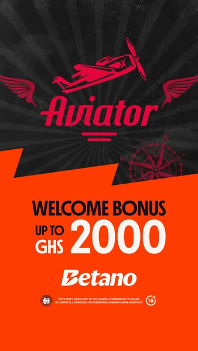
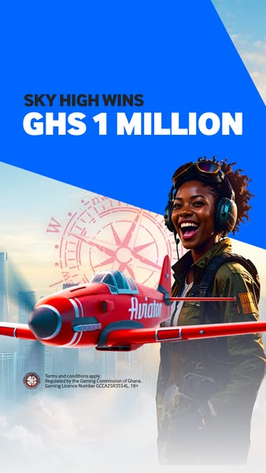
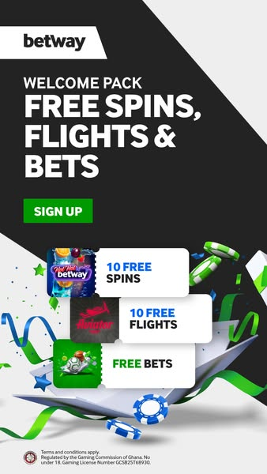
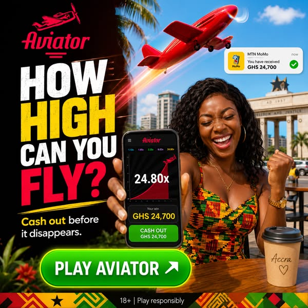

# Разведка GH / AVI (Aviator) — 2026-05-31

**Температура:** cold (0 наших заливов на Aviator; перенос гипотез из KE/CR2) · **Браузер:** изолированный playwright (recon_adlib_profile, залогинен) ·
**Охват:** запрос [`aviator`], 1 заход до сатурации — **62 уникальные карточки** из ~160 (вся типология конкурентов и углов покрыта).
**Оффер:** агрегатор · **welcome-bonus:** депозит 10 GHS → **20 free bets на Aviator** (выбор Aviator vs CR2 — скоринг O0, бонус заточен под Aviator).

## 1. Что проделано
Web-research рынка GH (market_profile в `geo.yaml`: MTN MoMo доминант, футбол=идентичность, Pidgin/Twi, селебы) + разведка Ad Library по `aviator`. Скоринг игры агрегатора (O0) → **Aviator** (bonus-fit + массовость; CR2 отклонён — бонус не на него). Конкуренты занесены в `slots/AVI.yaml` (7 references).

## 2. Конкуренты — топ (сигнал: живучесть × скейл × свежесть)
| Рекламодатель | Живёт (дн) | Скейл | Формат | Воронка | Хук-угол |
|---|--:|--:|---|---|---|
| **Betway Ghana** | ~72 | ×2 | static | betway.com.gh | free spins+**flights**+5 GHS free bet · «mobile money, live GPL, fast cash-outs» · «GHS 1M max payout» |
| **Betano Ghana** | ~68 | ×2 | static | betano.com.gh | big match-bonus «up to **GHS 2,000**» · глянцевый красный постер |
| **Luck&strategy** | 2 | **×20+** | static | (массовый свежак) | FOMO «friends withdrawing daily» + «working for pennies?» + «millionaires in Ghana 🇬🇭» + «catch the multiplier» + 100% bonus |
| **BetBoro promoter** | 11 | — | video | betboro.com.gh | free-value стек «FIRST 10 DEPOSITS: GHS600 + 210 free spins & Aviator Free Flights» |
| **Bang-0911 (Bangbet)** | 8 | ×3+ | video | PLAY.GOOGLE.COM | **low-entry** «Aviator GHS 10 → Mega Wins! Risk small, cash out big» #realmoney |
| **Cash Out King** | 10 | ×3-4 | video | — | cashout-angle (видео) |
| **Crazy Spinners** | 2 | ×5 | static | app | «legendary Aviator now on your phone, bonuses daily» |
| **Ghmjngh** | 0-2 | много | video | SPARKLE-STORE | adrenaline «fast rounds, catch the flight, feel the rush 18+» |

**Шум (отсеяно):** predictor/VIP-signals scam (WhatsApp), SPRIBE «Broadway Platform» (B2B), aviator-sunglasses (Velezeco/ErgoShop), Chevy. Aviator-predictor — отдельный паразит-жанр, не конкурент по офферу.

## 3. Паттерны гео (Aviator)
- **Рынок перегрет:** ~160 объявлений, скейл-доминант Luck&strategy ×20+ за 2 дня → высокая конкуренция за внимание, нужен дифференциатор, а не «ещё одна greed-реклама».
- **Формат-байас:** видео доминирует у серых аффилиатов (Bang/Ghmjngh/CashOutKing); статика-постер у брендов (Betano/Betway). Подтверждает перенос KE-гипотезы о статике, но **видео в Aviator массовее, чем было на KE/CR2**.
- **Воронка:** app-прокладка (PLAY.GOOGLE.COM, SPARKLE-STORE) у серых; direct (betway/betano/betboro.com.gh) у брендов. **У нас whitelist → льём прямо, без app-прокладки.**
- **Trust/углы:** greed «millionaires», FOMO «friends withdrawing», adrenaline «catch the multiplier», free-value «free flights/spins», low-entry «GHS 10». MoMo+football+cashout — у Betway.
- **Язык:** English + 🇬🇭; Pidgin почти не используется конкурентами → **наш потенциальный дифференциатор** (gh_pidgin_touch).

## 4. Хуки (извлечённые → реестр)
- `gh_low_entry` — «старт GH¢10» · objection_kill · **testing→подтверждён конкурентом** (Bang-0911 «GHS 10 → mega wins») + = наш бонус-депозит.
- `gh_momo_payout` — «выигрыш на MTN MoMo» · payment_trust · testing · Betway «mobile money, fast cash-outs» — рынок это юзает, но никто не делает **визуальный пруф зачисления** (KE-белое пятно повторяется).
- `gh_pidgin_touch` — Pidgin/Twi + 🇬🇭 · localization · testing · конкуренты почти не локализуют язык → свободная ниша.
- `avi_freebets` (новый, slot) — «dep, get free bets/flights» · free_value · testing · Betway/BetBoro подтверждают паттерн; наш бонус (20 free bets) ложится точно.
- `avi_fomo_greed` (новый, slot) — «friends withdrawing, red plane makes millionaires» · social_proof · **скейл-лидер Luck&strategy** = это работает на громкости, но переиспользовано всеми → берём как челленджер, не как ядро.

## 5. Анализ креативов (топ-разбор, с выкачанными медиа)

> Выкачаны постеры топ-конкурентов в `media/` (изолированный playwright → fbcdn). Видео-only
> карточки (Bangbet/CashOutKing/BetBoro) — постер-кадр частично; полные видео не тянули (тяжёлые).

### Betano Ghana — static (долгожитель 68 дн)

- **Визуал:** студийный тёмный постер, красный самолёт Aviator по диагонали вверх, крупная плашка «WELCOME BONUS GHS 2000», лого Betano. Премиум-глянец.
- **Текст:** primary «Register & Get up to GHS 2,000 Welcome Bonus! Endless fun on any device» · on-image «WELCOME BONUS GHS 2000» · полнота — full.
- **Почему живёт:** бренд-доверие + крупный match-бонус. **Контраст с нами:** давят суммой (2000), мы — low-entry (10 GHS вход). Не конкурируем суммой — берём доступностью + пруфом.

### Betway Ghana — static (долгожитель 72 дн)
 
- **Визуал:** фирменный чёрно-зелёный Betway, самолёт + «GHS 1 MILLION», «Aviator: Fortunes soar high»; второй постер — «free spins / free flights / 5 GHS free bet». Корпоративный глянец.
- **Текст:** «mobile money, live GPL action, fast cash-outs all in one»; «GHS 1M max payout» · полнота — full.
- **Почему живёт:** эталон связки **free-flights + MoMo + футбол (GPL) + cashout** — все наши гео-якоря в одном, но в бренд-обёртке. Берём связку, отдаём в нативном формате.

### Luck&strategy — static (бенчмарк скейла ×20+)

- **Визуал:** красный самолёт на тёмном небе + кричащий текст-оверлей. Грубовато-«партнёрский» дизайн (НЕ бренд-глянец) — народная подача крупным шрифтом.
- **Текст:** «Your friends are already withdrawing cash from Aviator every day! 💸 Why are you still working for pennies? The red plane is making millionaires in Ghana RIGHT NOW 🇬🇭. Catch the multiplier… Deposit 100% bonus» · полнота — full.
- **Почему скейлит:** anti-poverty + FOMO + greed + якорь 🇬🇭. Громко, но **переиспользовано ×20** — выгорает. Наш ход: тот же заряд, но в **нативном пруф-посте** (доверие вместо крика).

### Crazy Spinners / Ghmjngh — static/video (свежие, casual & adrenaline)
 
- **Визуал:** Crazy Spinners — casual app-постер «legendary Aviator flight simulator»; Ghmjngh — красный самолёт + «fast rounds, feel the rush» (видео-постер), тёмный фон.
- **Почему важны:** показывают «лёгкий» и «адреналиновый» полюса рынка; оба без trust-якоря → подтверждают, что **trust/proof никем не занят**.

### Bang-0911 (Bangbet) — video (low-entry, постер не вытянулся — видео-only)
- **Текст:** «Aviator – GHS 10 → Mega Wins Possible! ✈️🔥 Risk small, cash out big» #realmoney · app-прокладка Google Play · полнота — full.
- **Почему важен:** **прямое подтверждение нашего бонус-угла** (GHS 10 вход). Их слабость — app-прокладка (лишний шаг); наш whitelist убирает его.

### 🎯 Визуальный вывод (ПЕРЕСМОТРЕН после выкачки картинок — текст карточек обманывал)
> **Важно:** разбор по тексту карточек дал неверную гипотезу «MoMo-пруф = белое пятно».
> Выкачанные картинки её ОПРОВЕРГЛИ. Это причина, по которой медиа тянем всегда (SOP R9).

**Рынок GH/Aviator визуально зрелее, чем был KE/CR2.** Серые аффилиаты УЖЕ делают почти-CR005:
- **Ghmjngh** (`ghmjngh_adrenaline.png`): красный самолёт + ганка в **kente у Independence Arch (Accra)** + телефон «24.80x / GHS 24,700» + **плашка «MTN MoMo — You have received GHS 24,700 ✅»** + «PLAY AVIATOR». = MoMo-пруф + локальный типаж + 🇬🇭. **MoMo-proof НЕ свободен.**
- **Crazy Spinners** (`crazyspinners.png`): локальный парень в красном худи + телефон + «UP TO **20 BONUS FLIGHTS**» + 🇬🇭. = **наш бонус (20 free bets) уже льёт конкурент.**
- **Luck&strategy** (`luckstrategy_scale.png`, скейл ×20): народный стиль, телефон «10.27x / CASHOUT 5534 GHS», промокод GHANAWIN, иконки «fast payouts / secure / 24/7». Не глянец.
- **Betano/Betway** — бренд-глянец, но даже Betway даёт локального персонажа (африканка-пилот).

**Что РЕАЛЬНО ещё свободно (уточнённый дифференциатор):**
1. **Полная нативность.** Даже Ghmjngh — это ДИЗАЙНЕРСКИЙ баннер (самолёт-оверлей + текст + телефон-вставка), а не «реальный пост в ленте». CR005 победил на KE именно тем, что выглядел как настоящий FB-пост/скрин, а не реклама. На GH этого нет ни у кого → **наш edge = подлинный UGC-скрин (MoMo SMS / скрин геймплея / отзыв в ленте), без дизайн-баннера.**
2. **Pidgin/Twi-локализация текста** (Chale, Ɛyɛ) — конкуренты пишут чистым English.
3. **Реальный, не «жирный» выигрыш.** У всех фейково-крупные суммы (24,700 / 5534 / 1M). Скромный правдоподобный кэшаут (как 153 KES на KE) под low-entry-бонус 10 GHS выглядит достовернее → выше доверие на холодную.

**Общий штамп рынка для отстройки:** красный самолёт на тёмном/огненном фоне + золото. Наш ключевой креатив должен ломать штамп: «реальный скрин», MoMo-плашка как фокус, без глянцевого самолёта-оверлея.

## 6. Идеи для генерации (+ обоснование, ПЕРЕСМОТР после картинок)
| Идея | На чём основана | Хуки | Роль |
|---|---|---|---|
| **Подлинный UGC-скрин + MoMo SMS** | CR005 (2 FTD) + отстройка: у всех ДИЗАЙН-баннер, ни у кого нет «реального поста/скрина» | gh_momo_payout, gh_pidgin_touch, vis_native_fb_post*, vis_momo_green_proof* | **ядро/чемпион-гипотеза** |
| **Free-bets low-entry (правдоподобная сумма)** | bonus 10 GHS→20 free bets; Crazy Spinners уже льёт «20 bonus flights» → отстройка скромной реальной суммой | gh_low_entry, avi_freebets | челленджер (bonus-match) |
| **FOMO/greed нативно (Pidgin)** | Luck&strategy ×20 (скейл-лидер), но как реальный пост + Pidgin вместо дизайн-баннера | avi_fomo_greed, gh_pidgin_touch | челленджер |
| **Adrenaline cashout** | Ghmjngh / Cash Out King (видео-формат рынка) | avi_crash_adrenaline | челленджер (формат-тест) |
| **Football-anchor** | market_profile (футбол=идентичность, ЧМ-2026); никто из Aviator-конкурентов не использует | gh_pidgin_touch | челленджер (свободный угол) |

\* visual-хуки KE (`vis_native_fb_post`, `vis_mpesa_green_proof`) адаптируются под GH: M-Pesa-плашка → **MTN MoMo «You have received GHS …»**. Заведу GH-визуал-хуки при финализации плана.

## 7. План батча → следующий шаг
- **Чемпиона на GH/Aviator нет** (cold). Ядро-гипотеза = **подлинный UGC-скрин** (реальный пост/скрин MoMo SMS + геймплей), а НЕ дизайн-баннер. Картинки показали: MoMo-пруф сам по себе рынком уже занят (Ghmjngh) — отстраиваемся **уровнем нативности**, не самим фактом пруфа.
- **Челленджеры (4):** free-bets low-entry · FOMO-нативно(Pidgin) · adrenaline-cashout · football-anchor.
- **Формат:** старт — **статика** (GPT Image 2, отлаженный пайплайн). Рынок массово на видео → видео-тест отдельным заходом после первых FTD.
- **Уточнённые дифференциаторы (после анализа картинок):** (1) **подлинная нативность** — реальный скрин/пост, не глянцевый самолёт-баннер (этого нет ни у кого); (2) **Pidgin/Twi** в тексте (конкуренты на чистом English); (3) **правдоподобная сумма** под low-entry 10 GHS вместо фейковых 24,700/1M (выше доверие на холодную); (4) прямой залив без app-прокладки (whitelist). НЕ дифференциаторы (рынок занял): сам MoMo-пруф, bonus-flights, локальный типаж, 🇬🇭/kente.
- **PWA (Фаза 2.5):** перед create_campaign — ручной проход по PWA с байером (топ-паттерны).

> **Решение байера (гейт):** GO на батч (1 ядро + 4 челленджера, статика) → перехожу к Фазе 1 (промты) и Фазе 2 (генерация в syntx)? Или правки состава.
