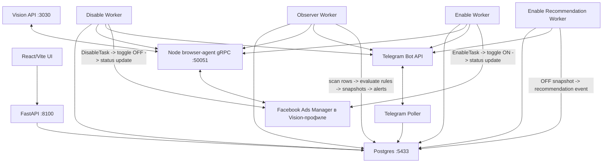

# Аудит системы FB Agent от 2026-04-24

## Краткое резюме

Система в целом запущена и отвечает: FastAPI `/health` возвращает `200`, browser-agent слушает `50051`, Vision API слушает `3030`, frontend доступен на фактическом Vite-порту `5174`. Browser-agent TypeScript проходит сборку и тесты, frontend production build проходит.

Главные риски:

- P0: Telegram bot token попадает в `.logs/*.log` через INFO-логи `httpx`.
- P1: endpoint проверки колонок браузера сломан на уровне маршрута frontend/backend и, вероятно, на уровне получения активной gRPC-сессии.
- P0: fresh install через Alembic нерабочий на пустой БД: начальная миграция не создаёт базовые таблицы, а `run.sh` запрещает fallback `create_all`, если миграции есть.
- P1: auto-enable safety controls в UI/API ненадёжны: глобальный флаг не возвращается из settings, per-ad override может удалиться следующим циклом.
- P1: enable recommendation worker может падать на `DetachedInstanceError` при `auto_enable_recommendations=True`.
- P1: parser Ads Manager некорректно разбирает числа с разделителями тысяч, что может занижать spend/clicks/CPM и ломать STOP/WARNING.
- P2: Python unit suite и frontend test suite сейчас красные.
- P2: frontend lint сейчас красный.
- P2: часть gRPC/browser contracts не совпадает с proto/настройками (`StreamSessionStatus`, `navigate`, remote Vision CDP host).
- P2: singleton и idempotency flows местами реализованы как check-then-insert без `ON CONFLICT`, что оставляет гонки.
- P2: ручной restart/stop worker из HTTP API управляет локальными PID-файлами и SIGKILL без процесс-менеджера как единого источника правды.

## Схема работы

Основной цикл:

1. `browser-agent` подключается к открытому Vision-профилю через CDP и читает текущую вкладку Ads Manager.
2. `Observer Worker` валидирует колонки, запускает `RunScanCycle`, получает строки объявлений, сопоставляет offer по коду, применяет rules/FSM.
3. Снимки пишутся в `fb_campaigns`/`fb_adsets`/`fb_ads`/`ad_snapshots`, дельты метрик в `ad_metric_history`.
4. При `STOP` observer создаёт `DisableTask` автоматически и отправляет Telegram-сообщение.
5. `Disable Worker` забирает задачи из Postgres через `SELECT FOR UPDATE SKIP LOCKED`, ищет toggle в Ads Manager, кликает OFF, затем сверяет состояние.
6. `Enable Recommendation Worker` ищет OFF-объявления, которые снова безопасны по правилам, публикует рекомендации и при включённом feature flag создаёт `EnableTask`.
7. `Enable Worker` выполняет обратный toggle ON.
8. UI читает агрегаты и настройки через FastAPI; Telegram poller принимает команды/callback.

## Подтверждённые проблемы

### P0. В логах раскрывается Telegram bot token

Факт: в `.logs/telegram.log`, `.logs/disable_worker.log`, `.logs/enable_recommendation_worker.log` присутствуют строки `httpx` вида `POST https://api.telegram.org/bot.../sendMessage`. Токен в URL не редактируется.

Причина: `TelegramBotClient` строит base URL с токеном в `core/telegram/client.py:44-48`, а entrypoints включают root logging на `INFO` (`run_disable_worker.py:28-32`, `run_enable_worker.py:32-36`, `run_enable_recommendation_worker.py:15-19`, `apps/telegram_poller/main.py:159-164`). `httpx` на INFO пишет полный URL.

Риск: любой доступ к логам даёт полный контроль над Telegram-ботом.

Рекомендация: на старте процессов выставить `logging.getLogger("httpx").setLevel(logging.WARNING)` и/или добавить фильтр редактирования `https://api.telegram.org/bot<token>` во всех handlers. Дополнительно ротировать текущий Telegram token, потому что он уже был записан в локальные логи.

### P1. Проверка колонок браузера не работает из UI

Факт: backend регистрирует `GET /api/browser/validate-columns` в `apps/api/routers/settings.py:330`, а frontend вызывает `/api/settings/browser/validate-columns` в `frontend/src/api.js:162`. Автотест `tests/unit/test_api_route_registration.py:81-87` падает ровно на этом маршруте. Ручной curl подтвердил `404` для `/api/settings/browser/validate-columns`.

Дополнительный риск: даже правильный backend route вызывает `GetSessionInfo(session_id="")` (`apps/api/routers/settings.py:347-350`). В `browser-agent` `getSessionInfo` требует конкретный session id, а метода list sessions в proto-сервисе не зарегистрировано (`services/browser-agent/src/index.ts:754-762`). Значит после исправления URL endpoint всё ещё может вернуть `502`.

Рекомендация: выбрать один контракт маршрута и добавить тест. Для gRPC либо добавить `ListSessions`, либо хранить активный browser session id в БД/runtime status, либо проксировать проверку через observer/browser-agent session manager без пустого id.

### P0. Fresh install через Alembic сломан

Факт: `migrations/versions/b2912a123fdf_initial_clean_schema.py:20-48` не создаёт таблицы, а сразу `drop_constraint/create_foreign_key` на уже существующих таблицах. При этом `run.sh:390-408` запрещает fallback `Base.metadata.create_all`, если в `migrations/versions` есть хоть одна миграция.

Проверка на временной пустой БД подтвердила падение: `alembic upgrade head` завершился ошибкой `UndefinedTableError: relation "ad_deposit_corrections" does not exist` на `ALTER TABLE ad_deposit_corrections DROP CONSTRAINT ...`.

Риск: новый Postgres volume может не подняться `./run.sh`/`make migrate`.

Рекомендация: сделать настоящую baseline migration с `create_table` для текущей модели или документированно зафиксировать prereq dump/restore. Лучше проверить на пустой временной БД в CI.

### P1. Глобальный auto-enable flag не возвращается из `/settings/observer`

Факт: `ObserverSettingsSchema` не содержит `auto_enable_recommendations` (`apps/api/schemas.py:42-50`), `GET /settings/observer` возвращает только threshold values и `is_scanning_enabled` (`apps/api/routers/settings.py:66-76`), при этом отдельный `PATCH /settings/observer/auto-enable` меняет этот флаг (`apps/api/routers/settings.py:121-127`).

Риск: UI может отображать авто-включение как выключенное, когда в БД оно включено. Следующий toggle из UI может не выключить опасное действие, а повторно включить или остаться рассинхронизированным.

Рекомендация: добавить `auto_enable_recommendations: bool = False` в schema и возвращать фактическое значение из GET. Добавить API/frontend test на round-trip `GET -> toggle -> GET`.

### P1. Per-ad запрет auto-enable удаляется следующим циклом

Факт: API создаёт `AdAutoEnableDisabled.cabinet_day_started_at=datetime.now(timezone.utc)` (`apps/api/routers/dashboard.py:2735-2738`), а worker удаляет все записи, где это поле не равно `ObserverSettings.cabinet_day_started_at` (`apps/enable_recommendation_worker/main.py:33-44`). Обычно это разные timestamps.

Риск: ручной safety override для конкретного объявления почти сразу исчезает до `_load_auto_enable_disabled_set`, и auto-enable снова может создать задачу на включение.

Рекомендация: при создании override брать ровно текущий `ObserverSettings.cabinet_day_started_at`, а если его нет, использовать `NULL`/отдельную стратегию истечения. Сравнение делать устойчивым к `NULL` и покрыть интеграционным тестом.

### P1. Auto-enable worker падает на detached ORM object

Факт: в логах был `DetachedInstanceError` на `apps/enable_recommendation_worker/main.py:63`. Код получает `created_events` внутри session, делает `commit`, выходит из session, затем в `_auto_enable_new_events` читает `event.fb_ad` (`apps/enable_recommendation_worker/main.py:55-64`).

Риск: при включённом `auto_enable_recommendations` воркер периодически падает и полагается на supervisor restart.

Рекомендация: не передавать наружу ORM-инстансы после закрытия session. Вернуть DTO с `event_id`, `ad_id`, `fb_ad_id` или заново загрузить события с `selectinload` внутри `_auto_enable_new_events`.

### P2. Singleton get-or-create не защищён от гонок

Факт: `get_or_create_observer_settings` делает `SELECT`, затем `INSERT`/`flush` (`core/settings_queries.py:30-36`), аналогично `get_or_create_telegram_settings` (`core/telegram/service.py:148-156`). У таблиц есть unique singleton key, но нет `ON CONFLICT`/обработки `IntegrityError`.

Риск: параллельный старт API/workers или два одновременных запроса настроек могут привести к unique violation и 500.

Рекомендация: использовать `insert(...).on_conflict_do_nothing(...).returning(...)` или ловить `IntegrityError`, делать rollback и повторный select.

### P2. Idempotency check-then-insert оставляет гонки задач

Факт: recommendation events и tasks сначала ищут существующую запись по idempotency key (`core/enable_recommendations/service.py:421-430`, `:644-647`, `apps/api/routers/dashboard.py:2130-2144`), затем создают новую (`core/enable_recommendations/service.py:442-456`, `:682-691`, `apps/api/routers/dashboard.py:2155-2165`).

Риск: два параллельных клика/воркера могут одновременно пройти check и один упадёт на unique constraint вместо возврата `existing/requeued`.

Рекомендация: перевести создание на PostgreSQL `ON CONFLICT DO NOTHING/UPDATE` с последующим select текущей строки; для dashboard disable task использовать существующий `idempotency_key` как конфликтный ключ.

### P3. В новых пользовательских текстах остались английские фрагменты

Факт: часть новых HTTP/Telegram/log сообщений смешивает русский и английский. Примеры: `"Задача не в состоянии retry/failed/stale-running"` (`apps/api/routers/dashboard.py:2061`), `"Telegram-группа для cutover должна быть supergroup."` (`apps/api/routers/settings.py:450`), `"forum topics"` (`apps/api/routers/settings.py:455`). В логах также встречаются англоязычные worker labels.

Риск: это нарушает локальное правило AGENTS.md: новые тексты ошибок, предупреждений, логов и Telegram-сообщений писать только на русском языке. Для оператора такие сообщения менее единообразны.

Рекомендация: пройти `rg` по строкам user-facing/logging и заменить новые английские фрагменты на русские, не меняя машинные enum/status values в API-контрактах.

### P2. Python unit suite сейчас красный

Запуск: `.venv/bin/pytest tests/unit -q`

Результат: `271 passed, 2 failed`.

Падения:

- `test_frontend_api_routes_are_registered_in_fastapi`: подтверждает route mismatch выше.
- `test_batch_save_snapshots_preserves_identity_names_on_empty_update`: mock ожидает меньше `session.execute`, чем делает текущий pipeline. Реальный код сначала пытается fallback lookup `FbAd` для строк без adset (`core/observer/snapshot_writer.py:257-269`), потом `_save_metric_deltas` читает `AdSnapshot` по всем `snapshot_data`, даже когда `ad_id_map` пуст (`core/observer/snapshot_writer.py:367-378`, `:516-523`).

Рекомендация: если поведение правильное, обновить тест. Если нет, оптимизировать `_save_metric_deltas`: при пустом `ad_id_map` возвращать `0` без лишнего запроса и явно не пытаться сохранять snapshots без `ad_id`.

### P1. Parser Ads Manager неправильно читает тысячи и десятичные разделители

Факт: `parseIntValue` удаляет только пробелы, а `parseMoney`/`parseMoneyOrNull`/`parseDecimalOrNull` берут первое regex-совпадение и заменяют первую запятую на точку (`services/browser-agent/src/parser.ts:384-407`).

Примеры риска:

- `$1,234.56` может стать `1.234`, а не `1234.56`.
- `1 234,56` для money может стать `1`, потому что regex остановится до пробела.
- `1,234` в EN locale может быть интерпретировано как `1.234`, а не `1234`.

Риск: расходы и стоимостные метрики могут быть занижены в 1000 раз, STOP/WARNING не сработают или сработают неверно.

Рекомендация: вынести locale-aware parser с тестами на RU/EN форматы: `1 234,56`, `1,234.56`, `$1,234.56`, `€1.234,56`, `1,234`, `1 234`. Для clicks/reach/impressions удалять все нецифровые разделители тысяч, но сохранять знак.

### P2. Frontend tests устарели относительно Tailwind-компонента

Запуск: `cd frontend && npm run build && npm test`

Результат: build OK, tests `20 passed, 2 failed`.

Падения: `frontend/src/test/StateIcon.test.jsx:26-33` ждёт классы `state-icon--lg` и `state-icon--stop_sent`, но `StateIcon` сейчас отдаёт Tailwind-классы из `frontend/src/components/StateIcon.jsx:27-33`.

Рекомендация: тестировать фактический контракт: текст, tooltip, размеры через ожидаемые Tailwind классы или добавить стабильный `data-testid`/semantic contract.

### P2. Frontend lint сейчас красный

Запуск: `cd frontend && npm run lint`

Результат: `13 errors, 33 warnings`.

Блокирующие errors в основном из-за тестового окружения: `Headers` и `global` не объявлены в ESLint config для `frontend/src/api.test.js` и `frontend/src/test/setup.js`. Есть также warnings по `no-console`, unused vars и новым правилам React hooks.

Рекомендация: добавить тестовые globals/env override в `frontend/eslint.config.js`, отдельно решить, какие React compiler warnings действительно включать как обязательные.

### P2. `StreamSessionStatus` не соответствует proto-контракту

Факт: proto задаёт server-stream `rpc StreamSessionStatus(StreamSessionStatusRequest) returns (stream SessionStatusEvent)` (`proto/v1/browser_session.proto:25-26`), а реализация в Node слушает `call.on("data")`/`call.on("end")`, как будто это client/bidi stream (`services/browser-agent/src/index.ts:191-215`).

Риск: если Python/UI начнут использовать этот метод, обычный server-stream клиент не получит heartbeat/status или зависнет.

Рекомендация: переписать handler под unary request + периодический `call.write(...)`, либо поменять proto на bidi-stream и регенерировать stubs.

### P2. Vision CDP host жёстко привязан к localhost

Факт: UI и settings позволяют менять `VISION_API_URL`, но CDP URL собирается как `http://127.0.0.1:${port}` (`services/browser-agent/src/session-manager.ts:304`, `services/browser-agent/src/vision-client.ts:151-152`).

Риск: remote Vision, Docker, `host.docker.internal` и нестандартный host API будут работать для `/list`/`/start`, но CDP подключение сломается.

Рекомендация: вычислять CDP host из `vision_api_url` или добавить отдельную настройку `VISION_CDP_HOST` с безопасным default `127.0.0.1`.

### P3. Python gRPC client `navigate()` вызывает не тот service stub

Факт: `Navigate` объявлен в `BrowserSessionService`, но `BrowserAgentClient.navigate()` вызывает `self._scanner_stub.Navigate` (`clients/python_grpc/client.py:171-178`).

Риск: метод сейчас, вероятно, не используется, но при первом вызове даст `AttributeError`.

Рекомендация: заменить на `self._browser_stub.Navigate(...)` и добавить unit-test на правильный stub.

### P3. Health Map выглядит как рабочая страница, но API заглушен

Факт: `getDashboardHealthMap` возвращает `Promise.resolve({ ads: [] })` без backend call (`frontend/src/api.js:177-178`), а страница ожидает реальные `nodes/warnings`.

Риск: оператор видит пустую карту как нормальное состояние, хотя данные не загружаются.

Рекомендация: либо реализовать backend endpoint, либо показывать явный disabled-state "Раздел ещё не подключён к API".

### P2. Runtime logs показывают asyncpg InvalidCachedStatementError после изменения схемы

Факт: в логах disable/enable/recommendation workers есть `asyncpg.exceptions.InvalidCachedStatementError: cached statement plan is invalid due to a database schema or configuration change`.

Риск: после миграций или schema changes долгоживущие воркеры могут падать до restart. Supervisor поднимет их, но без supervisor процесс может остановиться.

Рекомендация: после успешных миграций обязательно restart workers; добавить обработку этого класса ошибок как recoverable reconnect/dispose engine или запускать миграции до старта любых воркеров.

### P2. API restart endpoints управляют процессами напрямую

Факт: `apps/api/routers/settings.py:321-327` и `:370-376` останавливают/запускают worker из HTTP API, а helpers используют PID-файлы и SIGKILL (`apps/api/routers/settings.py:218-219`, `:255-256`).

Риск: рассинхронизация с supervisord, дубли процессов, убийство не того PID после reuse, разные источники правды (`.logs/pids.txt`, `/tmp/*.pid`, supervisord).

Рекомендация: оставить управление процессами одному слою: supervisor/systemd/docker compose. API должен выставлять флаг reconnect/restart request, а процесс-менеджер выполнять действие.

## Архитектурные замечания

- Разделение "scan / rules / actions" в целом есть: browser-agent сканирует/кликает, `core.rules` считает правила, workers выполняют действия. Но observer сейчас не только оценивает, а сразу создаёт auto-disable tasks и переводит STOP в CLAIMED (`apps/observer_worker/main.py` вокруг `_run_scan_cycle`/`_process_scan_results`). Это нужно явно считать продуктовым решением, потому что README/FSM-комментарии местами всё ещё описывают ручной CLAIMED после кнопки.
- Browser-agent вынужденно зависит от Meta DOM/React internals (`__reactProps`/`__reactFiber` в `services/browser-agent/src/parser.ts` и `ads-table.ts`). Это нормально для текущей задачи, но надо иметь быстрый regression-check на реальной странице после каждого изменения Ads Manager.
- `disconnectBrowser` в `SessionManager` не закрывает CDP browser, что соответствует комментарию и защищает Vision-профиль. `stopBrowser` реально останавливает профиль через Vision API (`services/browser-agent/src/session-manager.ts:180-197`), поэтому его нельзя вызывать из recovery по умолчанию.
- `auto_resume`/опасный restart профиля соблюдён: автоперезапуск отсутствующего CDP-порта завязан на `VISION_AUTO_RESTART_ON_MISSING_CDP`.

## Выполненные проверки

- `ruff check .` -> OK.
- `cd services/browser-agent && npm test` -> OK, 21 tests passed.
- `.venv/bin/pytest tests/unit -q` -> FAIL, 2 failed / 271 passed.
- `cd frontend && npm run build` -> OK.
- `cd frontend && npm test` -> FAIL, 2 failed / 20 passed.
- `cd frontend && npm run lint` -> FAIL, 13 errors / 33 warnings.
- `curl http://localhost:8100/health` -> `200 {"status":"ok","db":"ok"}`.
- `curl http://localhost:5174/` -> `200`, Vite frontend отвечает.
- In-app browser smoke: dashboard и settings рендерятся, console errors/warnings не обнаружены.
- `curl http://localhost:8100/api/settings/browser/validate-columns` -> `404`, подтверждён frontend/backend route mismatch.
- Fresh DB smoke на временной Postgres DB -> FAIL: `alembic upgrade head` падает на отсутствующей таблице `ad_deposit_corrections`; временная БД удалена.

## Ручные тест-кейсы для Vision/Ads Manager

1. Проверка колонок: из UI нажать действие проверки колонок, убедиться, что endpoint не 404/502, а возвращает список найденных/пропущенных колонок.
2. Zero-scan: открыть таблицу с нулевыми метриками начала суток, убедиться, что `ZeroScanGuard` не затирает рабочие данные до подтверждённого reset-сценария.
3. Happy path scan: включить scanning, дождаться runtime status `RUNNING`, проверить свежий `last_observed_at` и строки в "Объявления".
4. STOP auto-disable: создать/найти объявление с превышением STOP, проверить один Telegram STOP, один `DisableTask`, состояние `CLAIMED`, затем подтверждение `DISABLED` после OFF.
5. Toggle not found: задача отключения по ad id вне видимой таблицы должна перейти в retry с русским `last_error`, без падения browser-agent.
6. `no_toggle`: воспроизвести строку, где toggle cell найден, но switch не найден; проверить retry/backoff и Telegram update.
7. Enable recommendation: OFF-объявление с восстановившимися метриками создаёт recommendation event один раз на live batch.
8. Auto-enable feature flag: при выключенном `auto_enable_recommendations` не создаётся `EnableTask`; при включённом создаётся без `DetachedInstanceError`.
9. Telegram forum delivery: WARNING/STOP/ENABLE уходят в правильные topics, CONTROL принимает команды, private chat редиректится в группу.
10. Browser reconnect: сменить Vision settings в UI, запросить reconnect, убедиться, что profile не перезапускается без явного feature flag и observer восстанавливает session.
11. Fresh DB smoke: поднять пустой временный Postgres volume и выполнить `alembic upgrade head`; ожидание сейчас: вероятный fail, после фикса должен быть green.
12. Log safety: после Telegram actions проверить, что `.logs/*.log` не содержит `api.telegram.org/bot<token>`.

## Рекомендованный порядок исправлений

1. Закрыть утечку Telegram token в логах и ротировать текущий bot token.
2. Починить route и gRPC session lookup для validate-columns, добавить regression test.
3. Исправить auto-enable detached object.
4. Сделать baseline миграцию для пустой БД и CI smoke на fresh database.
5. Обновить красные тесты Python/frontend.
6. Починить parser чисел Ads Manager и добавить locale regression tests.
7. Закрыть singleton/idempotency гонки через `ON CONFLICT` или обработку `IntegrityError`.
8. Убрать управление worker PID из API в пользу supervisor/systemd/docker compose contract.
